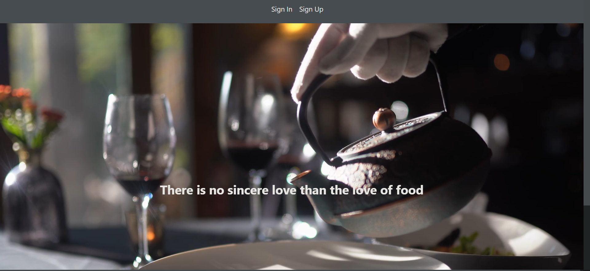
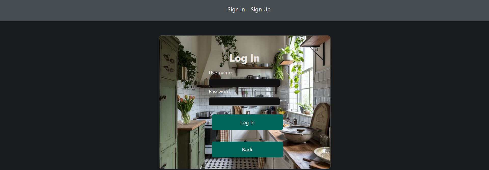
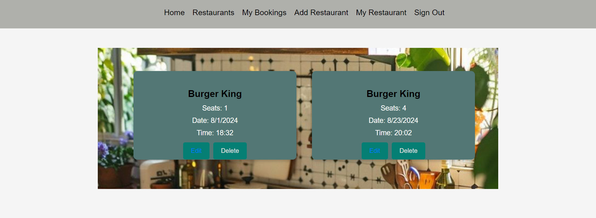
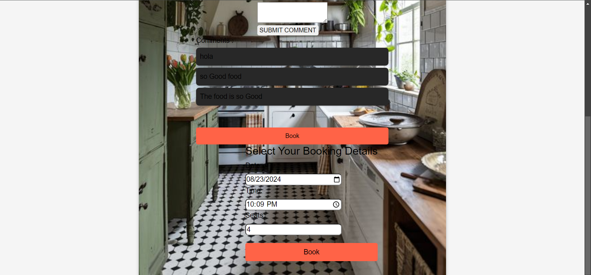
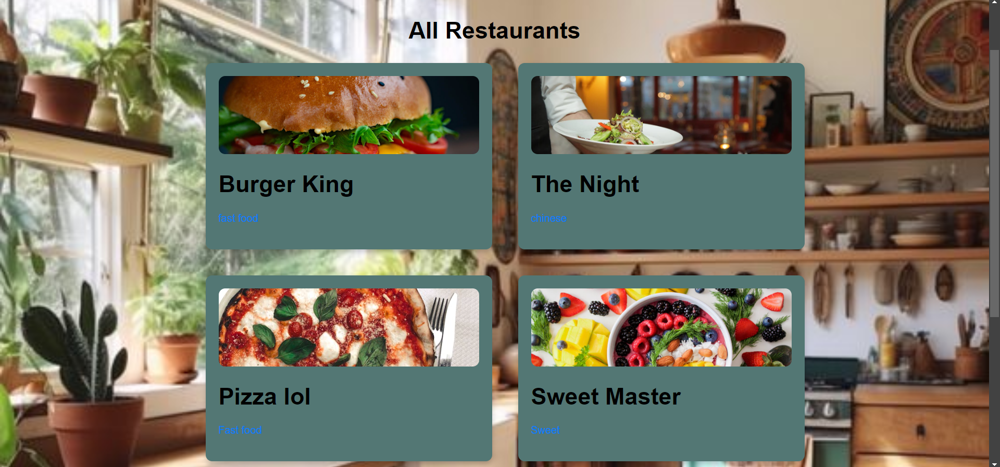
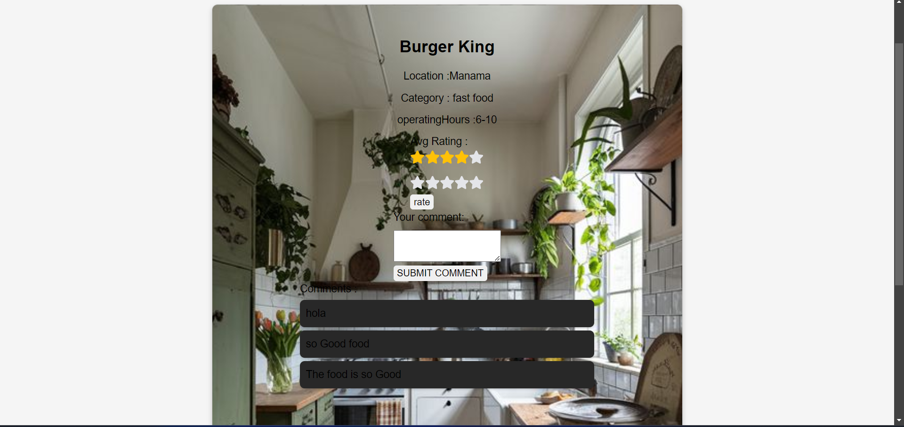

# Booking

## by : Mueen Ali , Mahmood althawadi , Ahmed Darwish

## Getting started :

- Trello Project Planning [here](https://trello.com/b/RRFwp2Ze/bookingcom-project)
- a link to deployed app [here](https://resbooking-hl061wlo3-mueens-projects-b1fddfae.vercel.app)
- a link to backend repository [here](https://github.com/VinsintQ/Booking-back-end)

### Scope :

A website where you can view restaurants and make a bookings , as restaurant owner you will be able to add restaurant and see all books in your restaurants

feature to add :

- [x] user able to rate restaurant from 1-5 by stars , and able to view average rating .

- [ ] RESTAURANT ABLE TO ACCEPT OR REJECT BOOKINGS .

- [ ] Admin to manage to website

## pictures from the app

## technologies used

- react
- javascripts
- node js
- mongoDB
- css
